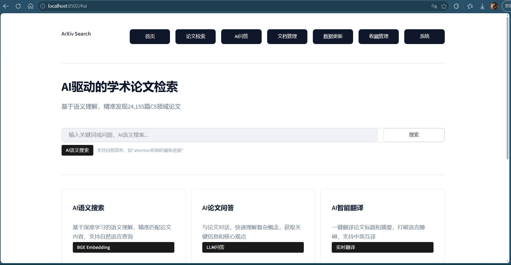

# ArXiv 智能论文检索系统

基于RAG技术的学术论文检索与问答平台，支持AI语义搜索、智能问答、论文翻译、文档上传等功能。



## 项目简介

本项目构建了一个面向计算机科学领域的智能论文检索系统，收录了**24,155篇**真实ArXiv论文，覆盖28个CS子分类。系统采用向量检索技术，支持自然语言语义搜索，响应时间小于0.3秒。

## 核心功能

### 1. AI语义搜索
- 基于BGE-large-zh-v1.5嵌入模型
- 支持自然语言查询（如"attention机制的改进方法"）
- 混合搜索：语义搜索 + 关键词搜索融合
- 相似度阈值筛选
- 分页浏览结果

### 2. AI论文问答
- 基于大语言模型
- 支持多论文综合分析
- 自动生成引用来源

### 3. AI智能翻译
- 实时翻译论文标题和摘要
- 支持中英互译
- 翻译结果缓存

### 4. 文档上传与管理
- 支持PDF、Word、Markdown、TXT格式
- 自动解析文档内容
- 自动向量化存储

### 5. 分类筛选
- 28个CS子分类（AI、CL、CV、LG等）
- 支持按分类组筛选
- 黑白灰主题标签

### 6. 收藏管理
- 论文收藏功能
- 自定义分类管理
- PDF在线浏览

### 7. 数据更新
- ArXiv增量更新
- 用户文档管理
- 更新日志记录

## 技术架构

```
┌─────────────────────────────────────────────────────────┐
│                    用户界面层                            │
│                  Streamlit Web应用                       │
├─────────────────────────────────────────────────────────┤
│                    应用逻辑层                            │
│  检索引擎 + 问答生成 + 翻译服务 + 收藏管理               │
├─────────────────────────────────────────────────────────┤
│                    数据处理层                            │
│  数据获取 + 文本清洗 + 向量化 + 索引构建                 │
├─────────────────────────────────────────────────────────┤
│                    数据存储层                            │
│  FAISS向量索引 + JSON元数据 + 本地文件存储               │
└─────────────────────────────────────────────────────────┘
```

## 技术栈

| 组件 | 技术 | 说明 |
|------|------|------|
| 前端 | Streamlit | 快速构建Web界面 |
| 向量索引 | FAISS | 高效相似度检索 |
| 嵌入模型 | BGE-large-zh-v1.5 | 中文语义理解 |
| 大语言模型 | 小米mimo-v2.5 | 论文问答与翻译 |
| 数据源 | ArXiv API | 学术论文数据库 |
| 编程语言 | Python 3.10+ | 后端开发 |

## 项目结构

```
arxiv-rag/
├── data/
│   ├── raw/                    # 原始论文数据
│   │   └── cs_all_papers.json  # 24,155篇CS论文
│   ├── models/                 # 嵌入模型
│   │   └── bge-large-zh-v1.5/  # 本地模型文件
│   ├── embeddings/             # 向量索引
│   │   └── faiss/              # FAISS索引文件
│   └── favorites/              # 收藏数据
├── src/
│   ├── data/                   # 数据获取模块
│   │   ├── fetch_papers.py     # ArXiv API数据采集
│   │   └── fetch_all_cs.py     # 批量获取脚本
│   ├── embedding/              # 向量化模块
│   │   └── build_index.py      # FAISS索引构建
│   ├── retrieval/              # 检索模块
│   │   └── search.py           # 语义/关键词/混合搜索
│   ├── generation/             # 生成模块
│   │   └── qa.py               # 论文问答
│   ├── utils/                  # 工具模块
│   │   ├── favorites.py        # 收藏管理
│   │   └── translator.py       # 翻译服务
│   └── app/                    # 应用界面
│       └── main.py             # Streamlit主应用
├── configs/                    # 配置文件
│   ├── config.py               # 全局配置
│   └── categories.py           # CS分类配置
├── requirements.txt            # 依赖列表
└── README.md                   # 项目文档
```

## 快速开始

### 环境要求
- Python 3.10+
- 8GB+ 内存
- 10GB+ 磁盘空间

### 安装步骤

1. **克隆项目**
```bash
git clone <repository-url>
cd arxiv-rag
```

2. **安装依赖**
```bash
pip install -r requirements.txt
```

3. **配置环境变量**
```bash
# 复制环境变量模板
cp .env.example .env

# 编辑.env文件，填入小米mimo API密钥
MIMO_API_KEY=your_api_key_here
MIMO_API_BASE_URL=https://token-plan-cn.xiaomimimo.com/v1
```

4. **下载嵌入模型**
```bash
# 使用HuggingFace镜像下载
export HF_ENDPOINT=https://hf-mirror.com
python -c "from huggingface_hub import snapshot_download; snapshot_download('BAAI/bge-large-zh-v1.5', local_dir='data/models/bge-large-zh-v1.5')"
```

5. **获取论文数据**
```bash
python src/data/fetch_all_cs.py
```

6. **构建向量索引**
```bash
python simple_build.py
```

7. **启动应用**
```bash
streamlit run src/app/main.py --server.port 8502
```

## 性能指标

| 指标 | 数值 |
|------|------|
| 收录论文 | 24,155篇 |
| CS分类覆盖 | 28个子分类 |
| 向量维度 | 1024维 |
| 检索响应时间 | < 0.3秒 |
| 索引构建时间 | 约2小时（CPU） |

## 项目亮点

### 技术亮点
1. **混合检索架构** - 语义搜索 + 关键词搜索融合，提升检索效果
2. **本地化部署** - 嵌入模型本地加载，无需外部API
3. **FAISS高效索引** - 支持24,000+论文的毫秒级检索
4. **实时翻译** - 按需调用mimo API，翻译结果缓存

### 解决的问题
1. **ChromaDB兼容性问题** - v1.5.9在Python 3.14上有HNSW索引问题，改用FAISS
2. **模型加载优化** - 实现延迟加载和预加载机制
3. **大文件写入** - 优化ChromaDB写入，使用小批次避免内存溢出

## 数据说明

### 数据来源
- **ArXiv API** - 学术论文预印本平台
- **获取方式** - REST API，每3秒1次请求
- **数据范围** - cs.*（计算机科学所有子分类）

### 数据字段
```json
{
  "id": "http://arxiv.org/abs/2401.00001",
  "title": "论文标题",
  "authors": ["作者1", "作者2"],
  "abstract": "论文摘要",
  "categories": ["cs.AI", "cs.CL"],
  "primary_category": "cs.AI",
  "published": "2024-01-01",
  "pdf_url": "http://arxiv.org/pdf/...",
  "abs_url": "http://arxiv.org/abs/..."
}
```

## 面试准备

### 技术问题回答

**Q: 为什么选择FAISS而不是ChromaDB？**
> ChromaDB v1.5.9在Python 3.14上有HNSW索引兼容性问题，导致数据写入后无法正常查询。FAISS更稳定，支持大规模向量索引，检索性能更好。

**Q: 向量检索的原理是什么？**
> 将文本通过嵌入模型转换为高维向量（1024维），存储在FAISS索引中。检索时，将查询文本同样转换为向量，通过余弦相似度计算与所有论文向量的距离，返回最相似的结果。

**Q: 如何优化检索速度？**
> 1. 使用FAISS的IVF索引，将向量分组加速检索
> 2. 本地加载嵌入模型，避免API调用延迟
> 3. 缓存搜索结果，减少重复计算
> 4. 使用较小的batch size减少内存占用

**Q: 项目遇到的主要挑战是什么？**
> 1. ChromaDB兼容性问题 - 改用FAISS解决
> 2. 24,000+论文的向量化耗时 - 优化batch处理
> 3. 模型加载慢 - 实现延迟加载和预加载机制
> 4. 国内网络访问HuggingFace - 使用镜像源下载

## 扩展方向

1. **多模态检索** - 支持图表、公式检索
2. **实时更新** - 增量索引更新
3. **个性化推荐** - 基于用户历史的个性化推荐
4. **论文摘要生成** - 自动生成论文摘要
5. **引用网络分析** - 分析论文引用关系

## 许可证

MIT License

## 联系方式

- 作者：李桂宇
- 邮箱：1943399340@qq.com